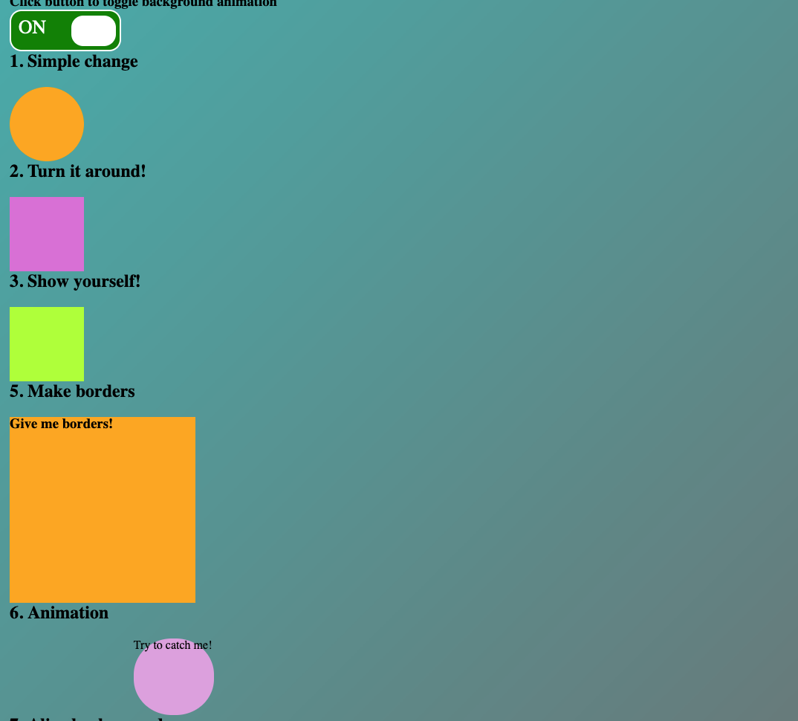

# Project Description
This project is for practising CSS animations with a bit of JavaScript

## Built with
- HTML
- CSS
- JavaScript

### Animations
- toggle button to toggle background color changes
- scale the size of circle on mouse hover 
- spinning a square on mouse hover
- show text inside a square on mouse hover
- animate borders of box with spreading effect
- stop a moving object on mouse hover
- background colors changes continuously 